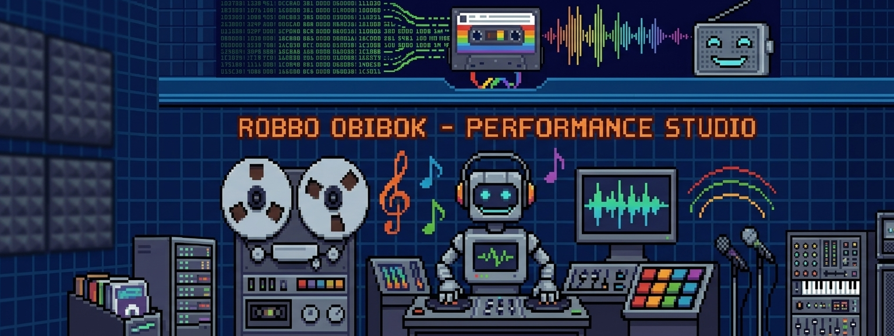

<p align="center">
  <pre>
    __________        ___.   ___.                ________  ___.    .__ ___.             __     
    \______   \  ____ \_ |__ \_ |__    ____      \_____  \ \_ |__  |__|\_ |__    ____  |  | __ 
     |       _/ /  _ \ | __ \ | __ \  /  _ \      /   |   \ | __ \ |  | | __ \  /  _ \ |  |/ / 
     |    |   \(  <_> )| \_\ \| \_\ \(  <_> )    /    |    \| \_\ \|  | | \_\ \(  <_> )|    <  
     |____|_  / \____/ |___  /|___  / \____/     \_______  /|___  /|__| |___  / \____/ |__|_ \ 
            \/             \/     \/                     \/     \/          \/              \/
  </pre>
</p>

<p align="center">
  
</p>

# Robbo Obibok v2 — The Ultimate Chiptune Bot

Named after a fusion of the 1989 Polish Atari classic *Robbo* and the avant-garde jazz band *Robotobibok*, this specialized Discord bot streams vintage retro chipmusic. Blending intricate technical grooves with retro charm, Robbo plays from **eight collections** spanning Atari, C64, ZX Spectrum, Amiga, demoscene keygens, and party music compos.

**Join a voice channel, type `!play`, and let the chips play.**

## What's New in v2

Complete rewrite with a focused architecture — small domain modules, Discord command cogs, and explicit runtime services instead of entrypoint facades or compatibility layers.

## Features

- 🎵 **Eight collections** — switch between ASMA (Atari SAP, 6 300+), HVSC (C64 SID, 60 000+), AY (ZX Spectrum, 4 500+), YM (Atari ST, 6 900+), ModArchive (Amiga/PC tracker modules, 225 000+), Tiny Music modules (~680), KGen (demoscene keygen music, 4 800+), and Party Music (top-5 music compo results grabbed monthly from Demozoo + historyczny sweep top-3 od 1990, 1 270 tracków)
- 🔀 **Shuffle loop** — never hear the same track twice in a row
- 🎼 **Rich metadata** — track name, composer, copyright from headers
- ❤️ **Favorites playlist** — react with ⭐ to a Now Playing embed to save/remove tracks
- ⏭️ **Skip**, **Stop**, **Now Playing**, **Stats**, **Search**
- 🔄 **Auto-advance** — moves to next track when current ends, with chiptune-aware monitoring
- 🧩 **Subsong playback** — demoscene/module tracks advance through embedded parts
- 💾 **Queue persistence** — restores compatible queues across restarts
- 📻 **Auto-start** — starts playing when someone joins a configured voice channel
- 🌙 **Auto-stop** — disconnects after the channel is empty for `auto.empty_timeout`
- 🛡️ **Playback lease + watchdog** — one guild owns playback at a time, with automatic audio recovery
- ⚙️ **Configurable** via `config.yaml`, including the archive root path
- 📀 **Local archives** — all collections served from disk, no remote crawling at runtime
- 🧭 **Richer monitor heuristics** — output-drop confirmation and format-aware timeout handling

## Commands

| Command | Description |
|---------|-------------|
| **Playback** | |
| `!play` / `!pl` / `!radio` / `!start` | Start shuffled radio from current collection |
| `!play <query>` | Search and immediately start the first match |
| `!play <number>` | Play a track from last search results |
| `!stop` / `!st` | Stop playback and disconnect |
| `!skip` / `!next` / `!nt` | Skip to next track |
| `!jump <n>` | Jump to track N in queue |
| `!np` | Show current track info |
| `!queue` / `!q` | Show upcoming tracks |
| `!history` | Show last 10 played tracks |
| `!sleep <min>` | Stop playback after N minutes (`!sleep 0` cancels; re-invoking replaces the timer) |
| `!loop` | Toggle repeat current track |
| `!volume <0-200>` | Set playback volume |
| `!clear` | Clear the queue |
| **Collections** | |
| `!flip` / `!switch` / `!toggle` / `!fl` | Rotate through all available collections |
| `!status` / `!mode` / `!collection` | Show current collection and queue info |
| `!search <query>` | Search tracks by name, directory, or author |
| `!hvsc` / `!c64` / `!sid` | Switch to **Commodore 64 SID** (~60 500) |
| `!asma` | Switch to **Atari SAP** (~6 300) |
| `!mod` / `!modarchive` / `!modules` | Switch to **ModArchive tracker modules** (~175 000) |
| `!ay` / `!spectrum` / `!zx` | Switch to **ZX Spectrum AY** (~4 500) |
| `!ym` / `!atarist` | Switch to **Atari ST YM** (~7 200) |
| `!tiny` / `!tm` | Switch to **Tiny Music modules** (~680) |
| `!kgen` / `!keygen` / `!k` | Switch to **Keygen Music** (~4 800) |
| `!party` / `!compo` | Switch to **Party Music** (top-5 music compos z Demozoo) |
| **Favorites & Blacklist** | |
| `!favorites` / `!favs` | Show your reaction-based favorites playlist |
| `!favplay` / `!fp` | Play favorites in shuffle mode |
| `!favsave` / `!pls` | Save current favorites as a named playlist |
| `!favload` / `!fpl` | Load and play a saved playlist |
| `!playlists` / `!plist` | List all saved playlists |
| `!blk` | Blacklist the currently playing track |
| `!blks` / `!blklist` | Show blacklist |
| `!blkrm <n>` | Remove track N from blacklist |
| **Tools & Info** | |
| `!help` | Show command reference |
| `!health` | Show runtime health diagnostics |
| `!stats` | Show radio stats (uptime, tracks played) |
| `!export` | Export queue as plain text |
| `!ocko` | Display an ASCII owl |

### Favorites System

React with **⭐ (star)** to a Now Playing embed to save the track to your favorites. React again to remove it (toggle). Data persists in `favorites.json`.

## Collections

| Collection | Format | Tracks (lokalnie) | Source |
|------------|--------|-------------------|--------|
| **ASMA** | `.sap` | 6 335 | Local `archiwum/asma/` |
| **HVSC** | `.sid` | 60 971 | Local `archiwum/hvsc/C64Music/` |
| **AY** | `.ay` | 43 480 | Local `archiwum/ay/` |
| **YM** | `.ym` | 7 427 | Local `archiwum/ym/` |
| **ModArchive** | `.mod`, `.xm`, `.s3m`, `.it` | 79 408 | Local `archiwum/modarchive/` |
| **Tiny Music** | `.mod`, `.xm`, `.s3m`, `.it` | 682 | Local `archiwum/tiny/` |
| **KGen** | `.mod`, `.xm`, `.s3m`, `.it` | 5 546 | Local `archiwum/kgen/` |
| **Party Music** | `.sid`, `.sap`, `.ay`, `.ym`, `.sndh`, `.nsf`, `.vgm`, trackery | 1 270 | Local `archiwum/party/` — comiesięczny grabber (top-5 compo, cron 7. dnia) + **legacy sweep** (top-3, wielkie party, pełna historia do 1990) |

All collections are served from disk.

## Downloading archives

All archives can be fetched and updated with one script:

```bash
./venv/bin/python3 scripts/fetch_archives.py all --check   # check only (no downloads)
./venv/bin/python3 scripts/fetch_archives.py hvsc          # single archive
./venv/bin/python3 scripts/fetch_archives.py all           # everything (ModArchive = GB!)
```

See `scripts/README.md` for sources and details (HVSC mirror, ASMA zip, AY/YM from
ay.strangled.net, KGen GitHub mirror, Tiny pouet-demozoo manifest).

## Quick Start

Supported Python versions: **3.11+**.

Audacious requirement: this bot is validated against **Audacious 4.6.1** and checks that version at startup.

### The lazy path — one script

```bash
git clone git@github.com:wiiii653/robbo-obibok-v2.git
cd robbo-obibok-v2
./install.sh                # deps systemowe + venv + token + systemd
./install.sh --archives     # (opcjonalnie) ściąga archiwa hvsc, asma, ay, ym, tiny, kgen
```

`install.sh` detects the distro (apt/dnf/pacman), asks for your Discord bot token,
installs the systemd service and optionally downloads the music archives.

### Ubuntu / Debian

```bash
sudo apt update
sudo apt install -y python3 python3-venv audacious audacious-plugins ffmpeg pipewire-pulse gstreamer1.0-plugins-good gstreamer1.0-plugins-bad sidplayfp

git clone git@github.com:wiiii653/robbo-obibok-v2.git
cd robbo-obibok-v2
make install
```

### Fedora

```bash
sudo dnf install -y python3 python3-virtualenv audacious audacious-plugins ffmpeg pipewire-utils gstreamer1-plugins-good gstreamer1-plugins-bad-free gstreamer1-plugins-bad-freeworld sidplayfp

git clone git@github.com:wiiii653/robbo-obibok-v2.git
cd robbo-obibok-v2
make install
```

### Arch Linux

```bash
sudo pacman -S python python-virtualenv audacious audacious-plugins ffmpeg pipewire gst-plugins-good gst-plugins-bad sidplayfp

git clone git@github.com:wiiii653/robbo-obibok-v2.git
cd robbo-obibok-v2
make install
```

## Running

```bash
cd robbo-obibok-v2
source venv/bin/activate

# Set your bot token
export DISCORD_BOT_TOKEN="your-token-here"

# Run via the launcher
./run_bot.sh
```

Development checks:

```bash
make test        # Unit tests
make check       # Tests, coverage, lint, and formatting checks
make lint        # Ruff linter
make format      # Ruff formatter

# Optional host checks for Audacious, FFmpeg, and PulseAudio/PipeWire
RUN_INTEGRATION=1 venv/bin/pytest -m integration
```

## Native input plugins (`plugins/`)

The bot plays YM (Atari ST), SAP (Atari), and SNDH (Atari ST music archive)
through custom native Audacious input plugins, vendored in this repo:

| Plugin | Format | Decoder | Source |
|--------|--------|---------|--------|
| `plugins/ym` | `.ym` (YM5/YM6, LHa `-lh5-`) | ST-Sound | `ym.cc` + `vendor/stsound/StSoundLibrary/` |
| `plugins/sap` | `.sap` (all types A–E, S, dual-POKEY) | ASAP 8.0.0 | `sap.cc` + `vendor/asap-8.0.0/` |
| `plugins/sndh` | `.sndh` / `.snd` (SNDH, ICE!/LZH-compressed) | sc68 | `sndh.cc` + `vendor_sc68/` |

Stock Audacious/GME cannot play YM at all (libgme never supported YM2149),
fails on SAP TYPE D/E (POKEY register range overlaps GME's 6502 stub), and has
no SNDH player; the native plugins close all three gaps. Build them (requires
`libaudcore-dev` + `libaudtag-dev`, autotools for the sc68 bootstrap):

```bash
cd plugins/ym && ./build.sh     # → ym.so
cd ../sap && ./build.sh         # → sap.so
cd ../sndh && ./build.sh        # → sndh.so
```

The build script also compiles a standalone render harness (`test_stsound` /
`test_asap`) for verification. Install by copying the `.so` into the Audacious
input-plugin directory (e.g. `/usr/lib/x86_64-linux-gnu/audacious/Input/`) and
restarting Audacious; the bot's health watchdog re-registers the plugin on the
next restart. The build is reproducible — `build.sh` produces bit-identical
`.so` files vs the installed production copies (verified by sha256).

## Invite the Bot

1. Go to [Discord Developer Portal](https://discord.com/developers/applications)
2. Select your bot application → **OAuth2 → URL Generator**
3. Scopes: `bot`, `applications.commands`
4. Permissions: `Send Messages`, `Connect`, `Speak`, `Use Voice Activity`
5. Use the generated URL to invite the bot to your server

## Systemd Service (Linux)

Run as a background service:

```bash
# Install dependencies and create the virtualenv
make install

# Store token in the environment file used by the service
printf 'DISCORD_BOT_TOKEN="%s"\n' "YOUR_TOKEN_HERE" > .env
chmod 600 .env

# Generate, install, enable, and start a service for this checkout
sudo deploy/install-systemd.sh

# Check logs
sudo journalctl -u robbo-obibok -f
```

The installer accepts optional arguments for a different checkout and service account:
`sudo deploy/install-systemd.sh /absolute/project/path app-user app-group`.

Tagged releases are built by GitHub Actions and published as workflow artifacts. To roll back,
check out the previous tag in a separate project directory, restore the existing `.env`, run
`make install`, and rerun `sudo deploy/install-systemd.sh /absolute/project/path app-user app-group`.

## Building Local Indexes

After cloning, build the local track indexes for the local archive collections:

```bash
make build-indexes

# or run the builders directly
python scripts/build_asma_index.py   # indexes all .sap files in archiwum/asma/
python scripts/build_hvsc_index.py   # indexes all .sid files in archiwum/hvsc/C64Music/
python scripts/build_ay_index.py     # indexes all .ay files in archiwum/ay/
python scripts/build_ym_index.py     # indexes all .ym files in archiwum/ym/
python scripts/build_tiny_index.py   # indexes all .mod/.xm/.it/.s3m files in archiwum/tiny/
python scripts/build_kgen_index.py   # indexes keygen music modules
python scripts/build_modarchive_index.py  # indexes ModArchive modules
```

These generate `*_cache_local.json` files for instant startup — no crawling at runtime.
Collection files are resolved under the configurable `archive.path` root.

## Configuration

Edit `config.yaml`:

```yaml
command_prefix: "!"
# Optional: restrict to a single server
# guild_id: 123456789012345678
audio:
  sink_name: "robbo_bot"
playback:
  loop: false           # true repeats the current track
  shuffle: true
archive:
  path: "/home/boruta/robbo-music"   # absolute path; relative also allowed
auto:
  start_channel: ""      # voice channel name (empty = disabled)
  empty_timeout: 60      # seconds before disconnect when empty
format_volumes:
  sid: 115               # SID files at 115% volume (0-200)
  mod: 115               # Module formats
  xm: 115
  s3m: 115
  it: 115
```

## File Structure

```
robbo-obibok-v2/
├── src/                     # Source modules
│   ├── __init__.py
│   ├── __main__.py          # python -m src entry point
│   ├── audio.py             # PulseAudio + Audacious control
│   ├── bot.py               # Discord bot setup + cog loading
│   ├── cog_shared.py        # Shared helpers (FAVORITE_EMOJI, PlaybackCtx)
│   ├── cogs.py              # Cog registry
│   ├── collection_cog.py    # Collection switching commands
│   ├── collection_loader.py # Collection registry, index loaders, metadata
│   ├── config.py            # YAML config loading
│   ├── discord_compat.py    # discord.py compatibility layer
│   ├── embeds.py            # Discord rich embed builders
│   ├── favorites.py         # Reaction favorites + named playlists
│   ├── favorites_cog.py     # Favorites / blacklist / playlist commands
│   ├── launcher.py          # Startup, signals, shutdown
│   ├── lease.py             # Single-guild playback ownership
│   ├── models.py            # Collection and PlaybackState
│   ├── monitor.py           # Track completion detection
│   ├── persistence.py       # JSON file I/O
│   ├── playback.py          # Playback orchestrator
│   ├── playback_cog.py      # Playback commands (!play, !skip, etc.)
│   ├── queue.py             # Queue shuffle, blacklist, persistence
│   ├── stream.py            # Voice stream source
│   ├── voice_streams.py      # Discord stream lifecycle ownership
│   └── tools_cog.py         # Utility commands (!stats, !ocko, !help)
├── tests/                   # 230+ unit tests
├── scripts/                 # Index builder scripts
├── deploy/                  # systemd service files
├── extras/                  # Assets (banner, avatar)
├── config.yaml              # Runtime configuration
├── pyproject.toml           # Dependencies + tool config
├── Makefile                 # Build/test commands
├── run_bot.sh               # Entrypoint wrapper
```

### Runtime boundaries

- `PlaybackEngine` owns queues, track resolution, and player commands.
- Discord cogs translate commands and gateway events into engine operations.
- `ObibokBot` owns application state, leases, and recovery policy.
- `VoiceStreamManager` owns only Discord audio-source lifecycle; it never selects tracks or changes queue state.
- `TrackMonitor` is copied per active session and owns track-end detection.

## Audio Effects

The bot enables Audacious's **Compressor** effect plugin at startup for consistent loudness across collections.

To verify: `audtool plugin-is-enabled compressor`
To adjust: edit `~/.config/audacious/config` and restart the bot.

## Troubleshooting

| Symptom | Likely Fix |
|---------|-----------|
| `RuntimeError: PyNaCl library needed` | `pip install pynacl` |
| Bot doesn't respond to commands | Enable **Message Content Intent** in Discord Developer Portal |
| `Unsupported Audacious version ...` | Install Audacious **4.6.1** and restart the bot |
| Bot joins VC but no sound | Audacious not running — restart bot, or run `audacious --headless` manually |
| `!play` says "Join a voice channel" | You must be in a voice channel when issuing the command |
| Bot auto-disconnects too fast | Increase `auto.empty_timeout` in config |
| SID metadata is empty | Some SID files lack embedded headers — filename is shown as fallback |
